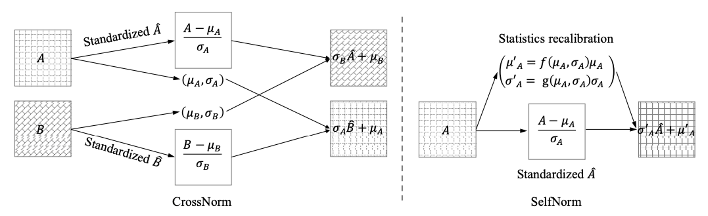

## CrossNorm (CN) and SelfNorm (SN) (Accepted at ICCV 2021)

This is the official PyTorch implementation of our [CNSN paper](https://arxiv.org/abs/2102.02811), in which we propose CrossNorm (CN) and SelfNorm (SN), two simple, effective, and complementary normalization techniques to improve generalization robustness under distribution shifts.

```
@article{tang2021cnsn,
  title={CrossNorm and SelfNorm for Generalization under Distribution Shifts},
  author={Zhiqiang Tang, Yunhe Gao, Yi Zhu, Zhi Zhang, Mu Li, Dimitris Metaxas},
  journal={arXiv preprint arXiv:2102.02811},
  year={2021}
}
```

## Install dependencies
  ```shell
  conda create --name cnsn python=3.7
  conda activate cnsn
  conda install numpy
  conda install pytorch==1.2.0 torchvision==0.4.0 cudatoolkit=10.0 -c pytorch
  ```


## Prepare datasets
- Download CIFAR-10-C and CIFAR-100-C datasets with:

    ```
    mkdir -p ./data
    curl -O https://zenodo.org/record/2535967/files/CIFAR-10-C.tar
    curl -O https://zenodo.org/record/3555552/files/CIFAR-100-C.tar
    tar -xvf CIFAR-100-C.tar -C data/
    tar -xvf CIFAR-10-C.tar -C data/
    ```

- Download ImageNet-C with:

    ```
    mkdir -p ./data/ImageNet-C
    curl -O https://zenodo.org/record/2235448/files/blur.tar
    curl -O https://zenodo.org/record/2235448/files/digital.tar
    curl -O https://zenodo.org/record/2235448/files/noise.tar
    curl -O https://zenodo.org/record/2235448/files/weather.tar
    tar -xvf blur.tar -C data/ImageNet-C
    tar -xvf digital.tar -C data/ImageNet-C
    tar -xvf noise.tar -C data/ImageNet-C
    tar -xvf weather.tar -C data/ImageNet-C
    ```

## Usage
We have included sample scripts in `cifar10-scripts`, `cifar100-scripts`, and `imagenet-scripts`. 
For example, there are 5 scripts for CIFAR-100 and WideResNet: 

1. `./cifar100-scripts/wideresnet/run-cn.sh`
   
2. `./cifar100-scripts/wideresnet/run-sn.sh`
   
3. `./cifar100-scripts/wideresnet/run-cnsn.sh`
   
4. `./cifar100-scripts/wideresnet/run-cnsn-consist.sh` (Use CNSN with JSD consistency regularization)
   
5. `./cifar100-scripts/wideresnet/run-cnsn-augmix.sh` (Use CNSN with AugMix)


## Pretrained models
- Pretrained ResNet-50 ImageNet classifiers are available:
1. [ResNet-50 + CN](https://drive.google.com/file/d/1F-2uW1-zkPNg38PhxGmdYc8O3eow7IFG/view?usp=sharing)
2. [ResNet-50 + SN](https://drive.google.com/file/d/1ErWPFGUnkgOPKKjwgyNaAAocCWCw1R4I/view?usp=sharing)
3. [ResNet-50 + CNSN](https://drive.google.com/file/d/1Y-r2ET518jBwe2F-qG80glE32C6KQNHg/view?usp=sharing)
4. [ResNet-50 + CNSN + IBN + AugMix](https://drive.google.com/file/d/1Uov7bRZYY7q38FBXn3Q1HwWr8PnGKase/view?usp=sharing).


- Results of the above 4 ResNet-50 models on ImageNet:

|         | +CN | +SN   | +CNSN   | +CNSN+IBN+AugMix |
| :-------- |:---------:| :----:| :----:| :---: |
| Top-1 err | 23.3 | 23.7 | 23.3 | 22.3 |
| mCE   | 75.1     | 73.8 | 69.7 | 62.8 |
